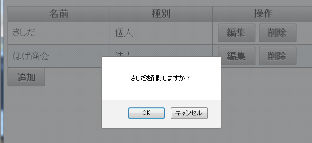
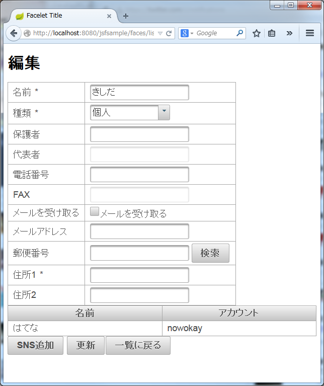
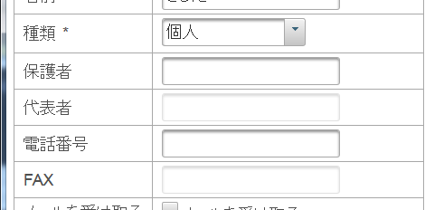
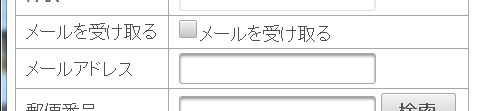
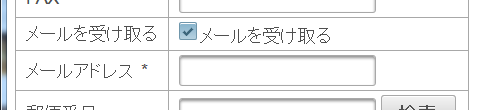
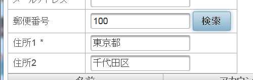
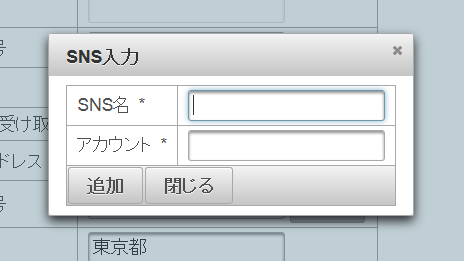
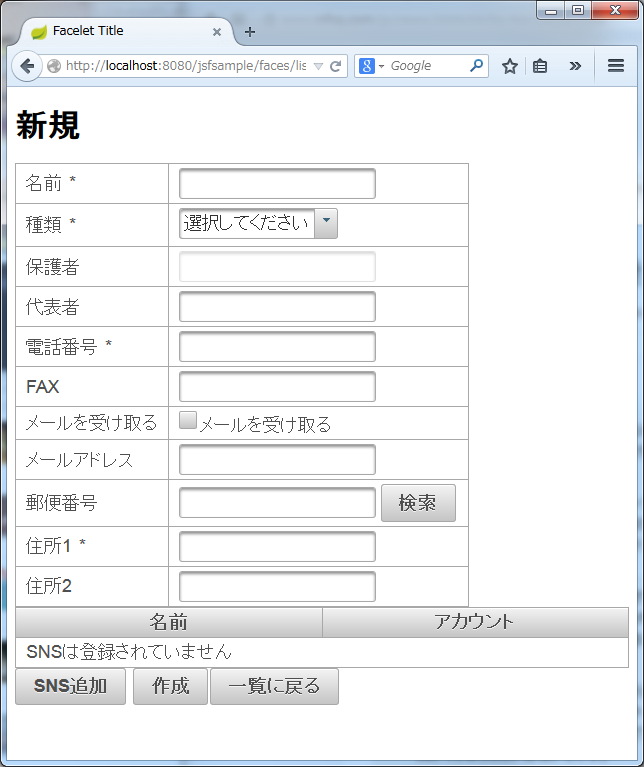

# JSF/Primefacesサンプル

## 一覧


一覧はp:dataTableを使います

```
<p:dataTable var="m" value="#{repository.members}" id="tblMember">
```

編集ボタンで、actionの引数に指定行オブジェクトが渡せます。
```
<p:commandButton value="編集" action="#{memberBean.startEdit(m)}" ajax="false"/>
```

## JavaScriptダイアログとの連携
削除ボタンを押すとJavaScriptの確認ダイアログを表示します。



```
<p:commandButton value="削除" onclick="if(! confirm('#{m.memberName}を削除しますか？')){return false;}"
                 action="#{memberBean.doDelete()}"
                 oncomplete="if(!args.isSuccess) {alert('削除できませんでした');}"
                 update=":fm:tblMember"
                 >
    <f:setPropertyActionListener target="#{memberBean.selected}" value="#{m}"/>
</p:commandButton>
```

削除する行を設定するためにf:setPropertyActionListerを使っています。

```
<f:setPropertyActionListener target="#{memberBean.selected}" value="#{m}"/>
```

処理順は、actionListener->setPropertyActionListener->actionの順になります(たぶん)

ダイアログ表示はonclickイベントにJavaScriptを記述しています。

```
onclick="if(! confirm('#{m.memberName}を削除しますか？')){return false;}"
```

このあとに続いて処理が埋め込まれるので、ちゃんと{}で囲っておく必要があります。

削除処理では、法人は削除に失敗するようにしています。
Java側での結果をJavaScriptに伝えるには、RequestContextにaddCallbackParamでパラメータを設定します。

```
RequestContext.getCurrentInstance().addCallbackParam("isSuccess", success);
```

処理後にはoncompleteが実行されます。ここで、argsからパラメータを受け取ることができます。

```
oncomplete="if(!args.isSuccess) {alert('削除できませんでした');}"
```

## 編集画面


編集用の値を保持するようにします。
(元データを編集してしまうと、キャンセルがきかない)
```
    @Setter @Getter
    Member editing = null;
```

タイトルやボタンは、新規と編集で切り替えます。
編集状態を判定するプロパティを用意します。
```
    public boolean isEdit(){
        return original.isPresent();
    }
```

文言は式言語の条件演算子で。
```
<h1>#{memberBean.edit ? "編集" : "新規"}</h1>
```

ボタンはrenderedで
```
            <p:commandButton value="作成" action="#{memberBean.doCreate()}" rendered="#{!memberBean.edit}" process="pnlMember" update="pnlMember msg"/>
            <p:commandButton value="更新" action="#{memberBean.doEdit()}" rendered="#{memberBean.edit}" process="pnlMember" update="pnlMember msg"/>
```

ダイアログのデータが送られないようprocessでパネルを指定しています。
入力エラーでの表示更新のために、updateでパネルとメッセージを指定しています。

## コンボボックスの内容での入力項目切り替え
コンボボックスで入力項目の有効・無効の切り替え



selectOneMenuでp:ajaxを含めて更新対象のコンポーネントを指定します。
```
<p:selectOneMenu id="selType" value="#{memberBean.editing.type}" required="true">
    <f:converter binding="#{memberBean.memberTypeConverter}"/>
    <f:selectItem itemLabel="選択してください"/>
    <f:selectItems value="#{memberBean.memberTypes}" var="t" itemLabel="#{t.displayName}"/>
    <p:ajax update="txtParent txtRepresentative txtFax lblTelephone"/>
</p:selectOneMenu>
```
必須の*を表示するため、ラベルもupdateに含めます。

ほんとは表示・非表示を切り替えたかったけど、panelGridの行を表示・非表示するやりかたがわからなかった。

## チェックボックスでの必須・任意きりかえ
チェックボックスで必須・任意をきりかえます。



selectBooleanCheckboxにp:ajaxを含めてupdateに更新対象のコンポーネントを指定します。
```
<p:selectBooleanCheckbox itemLabel="メールを受け取る" 
                            value="#{memberBean.editing.allowMail}">
 <p:ajax update="txtMailAddress lblMailAddress"/>
</p:selectBooleanCheckbox>
```

必須の*を表示するため、ラベルもupdateに含めます。




## Ajax検索
郵便番号検索など、Ajaxによる検索フォーム


```
<p:inputText id="txtZipCode" value="#{memberBean.editing.zipCode}"/>
<p:commandButton value="検索" action="#{memberBean.searchZipcode()}"
                 process="@this txtZipCode"
                 update="txtAddress1 txtAddress2">
    <p:resetInput target="txtAddress1 txtAddress2"/>
</p:commandButton>
```

processには検索内容のコンポーネントだけではなく、ボタン自身の情報も送信するために@thisを指定します。
入力エラーが出たあとで正常に表示更新できなくなるので、resetInputを設定します。

## ダイアログ入力
ダイアログでの入力



JavaScriptでダイアログをhide()する必要があるため、JavaScriptからコンポーネントを利用するための変数としてwidgetVarを指定します。
```
<p:dialog id="dlgInputSns" widgetVar="dlgInputSnsVar" header="SNS入力" modal="true" resizable="false">
```

JavaScriptからコンポーネントを取得するには、widgetVarで指定した値をPF関数で指定します。
```
<p:commandButton value="閉じる" onclick="PF('dlgInputSnsVar').hide()" immediate="true"/>
```
入力チェックを行わないために、immediateをtrueにする必要があります。

追加処理が終わったとき、バリデーションエラーが出てない場合に限ってダイアログを閉じるようにするため、args.validationFailedでの判定を行っています。
```
<p:commandButton value="追加"
                  action="#{memberBean.doSnsCreate()}"
                  process="dlgInputSns" update="tblSns pnlSns msgSns"
                  oncomplete="if(!args.validationFailed) PF('dlgInputSnsVar').hide()"
                  />
```

## 新規画面


