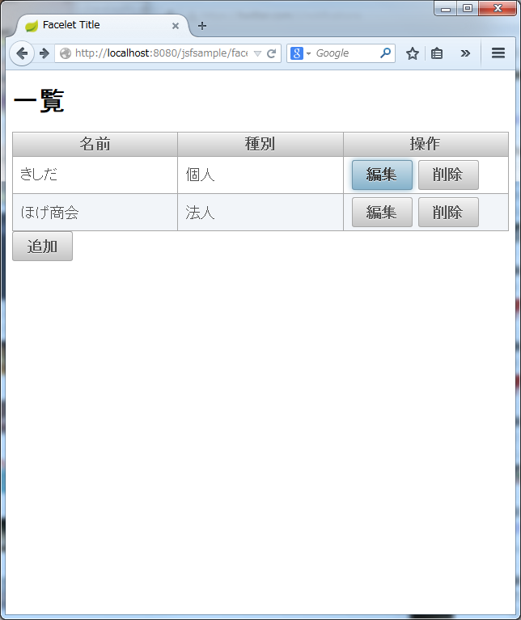

# JSF/Primefacesサンプル

## 一覧


一覧はp:dataTableを使います

```
<p:dataTable var="m" value="#{repository.members}" id="tblMember">
```

編集ボタンで、actionの引数に指定行オブジェクトが渡せます。
```
<p:commandButton value="編集" action="#{memberBean.startEdit(m)}" ajax="false"/>
```

## JavaScriptダイアログとの連携
削除ボタンを押すとJavaScriptの確認ダイアログを表示します。


```
<p:commandButton value="削除" onclick="if(! confirm('#{m.memberName}を削除しますか？')){return false;}"
                 action="#{memberBean.doDelete()}"
                 oncomplete="if(!args.isSuccess) {alert('削除できませんでした');}"
                 update=":fm:tblMember"
                 >
    <f:setPropertyActionListener target="#{memberBean.selected}" value="#{m}"/>
</p:commandButton>
```

削除する行を設定するためにf:setPropertyActionListerを使っています。

```
<f:setPropertyActionListener target="#{memberBean.selected}" value="#{m}"/>
```

処理順は、actionListener->setPropertyActionListener->actionの順になります(たぶん)

ダイアログ表示はonclickイベントにJavaScriptを記述しています。

```
onclick="if(! confirm('#{m.memberName}を削除しますか？')){return false;}"
```

このあとに続いて処理が埋め込まれるので、ちゃんと{}で囲っておく必要があります。

削除処理では、法人は削除に失敗するようにしています。
Java側での結果をJavaScriptに伝えるには、RequestContextにaddCallbackParamでパラメータを設定します。

```
RequestContext.getCurrentInstance().addCallbackParam("isSuccess", success);
```

処理後にはoncompleteが実行されます。ここで、argsからパラメータを受け取ることができます。

```
oncomplete="if(!args.isSuccess) {alert('削除できませんでした');}"
```


